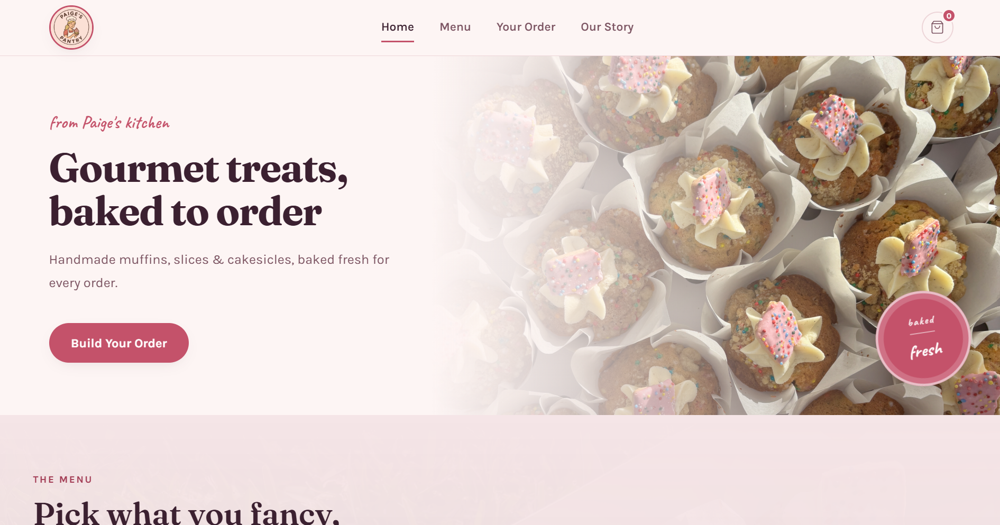

# Paige's Pantry 🧁

A custom-built website for Paige's Pantry, a gourmet baking business specialising in handmade muffins, slices, and cake pops.

## 🌟 About the Project

Paige's Pantry is not a traditional bakery. The brand focuses on homemade, premium baked goods made fresh to order, with a focus on quality ingredients, attention to detail, and a personal touch.

This website was built to create an online presence for the business while keeping the ordering process simple and customer-friendly.

## ✨ Features

- Responsive design for desktop, tablet, and mobile
- Product showcase for muffins, slices, and cake pops
- Brand story section
- Seasonal bake promotion section
- Order interest / order summary functionality
- Custom branding and visuals
- Optimised layout for customer experience

## 🛠️ Built With

- HTML5
- CSS3
- JavaScript
- Custom graphics and imagery

## 📸 Products Featured

Current products include:

- Banana Walnut Muffins
- Salted Caramel Slice
- Birthday Cake Pops

## 🎯 Project Goals

The main goals of the website were to:

- Build a professional online presence for Paige's Pantry
- Showcase products in a visually appealing way
- Create a simple ordering journey without requiring full e-commerce functionality
- Reflect the handmade and premium nature of the brand

## 🚀 Future Improvements

Potential future updates include:

- Online ordering system
- Customer enquiry form
- Seasonal product pages
- Customer reviews section
- Further SEO improvements

## 📍 Live Website

paigespantry.com.au

---

Built by AV Web Studios
